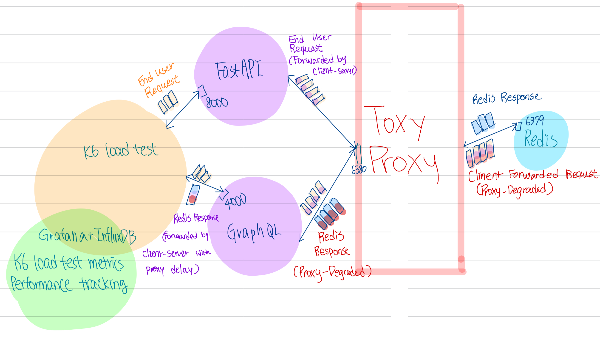

# Bench-the-query


## What is Bench the Query?
- Bench the Query helps developers to choose client servers based on traffic load and context size.
- The containerized Benchmark tool are light-weighted and can be tested seperately.
- A versatile tool to benchmark various client servers with minimal code. 
- Automates deployment for database, query protocols and load test in one docker compile. 
- Furthermore, benchmark results are made accessible in a pre-configured Grafana Dashboard. 
- Users use this tool by entering a list of payload size used in querying and setting desire loads in load test the same way as K6 load test. 


## Benchmark Options

#### Datastore Options  

| Name | Description | Type | Setup |  Default value |
| -------------- | --------------------  | ------------------ | ---- | ------ |
| `STRING_SIZES` | String count dataset; <br>loaded to DB at compose up | env var, deploy before <br> pipeline runtime | ./env | 3,5,10,<br>,15,30,50<br>,75,100,500,<br>750,1000,1500,<br>2000 |
| `NUM_USER` | Number of users to be loaded in DB | env var, deploy before pipeline runtime  | ./env | `10` |


#### Load Test Options 

 Bench the Query currently supports cold cache DB + GET request on load test  via K6. To utilize automated pre-configured Grafana uptream live monitoring dashboard it is encouraged the user follows the recoomended options:
  - Enabling parallel and sequntial load testing with virtual user (VUs) as thread to simulate users.
  - Customize a sheduled traffic surge with K6's format [1]. 
  - Stick with K6 load test metrics at reference [2] for efficient upstream processing.

- Reference 
  [1]https://grafana.com/docs/k6/latest/set-up/set-up-distributed-k6/usage/scheduling-tests/ <br>
  [2]https://grafana.com/docs/k6/latest/using-k6/execution-context-variables/ <br>

| Name | Description | Type | Setup |  Default value |
| :--------------: | :----------------:  | ----------- | ------- | ----------------------- |
| `vus` | K6 virtual users by <br> host machine threads | java script <br>, deploy at pipeline runtime | ./load_test/scripts/k6_options.js| `20` |
| `iterations` | K6 VUs' task iterations |java script, deploy at pipeline runtime | ./load_test/scripts/k6_options.js| `100` |

#### Toxy Proxy Options  
  - Toxy Proxy by Shopfiy is injected between client server and RedisDB to similate rate limiting, RTT, traffic surges and other unforeseen challenges. 
  - The goal is to examine client server strategy and adpatation under a degaradated system. 
  - TCP pakcets and traffics are simulated by K6 see schematic below:
  
  - Use Http API to setup toxy [1]
- Reference 
 [1]https://github.com/Shopify/toxiproxy?tab=readme-ov-file#http-api 

| Name | Description | Type | Setup | Remark for simulation |  Default value |
| `latency` | A delay to all data going through the proxy in ms. | HTTP field | RTT simulation; can apply seperately to up and downstream | `0` |
| `jitter` | The delay is equal to latency +/- jitter ms. | HTTP field | set 0 |`0` |
| `limit_data` |Closes connection if data transmitted exceeded limit.  | HTTP field | Rate limiting | `0` |
| `rate` | Maximum connection rate on Proxy in KB/s. | HTTP field | -- | `0` |
| `slicer` | Slice to fit specific packet size in Bytes, allowing latency addition between packet on silicer attribute| HTTP field | -- | `0` |


## Bench the Query under the hood:

A containerized benchmarking suite to compare GraphQL and REST API (FastAPI for now, more later) performance under simulated load using K6 while enabling realtime tracking in Grafana.
  If -> desinates dataflow, we have: 
  Lua script -> Redis <-> GraphQL & FastAPI <-> K6 -> InfluxDB-> Grafana. 

## What Bench the Query is not?
- While more client servers are to be added more a more inclusive benchmark test, the client protocols and security checks are not made to be serve production codes. 


# Running Bench the Query 
Git clone the project
## Step 1 Place Payload Size Variabilities 
```bash 
git clone https://github.com/evalece/bench-the-query.git 
```

If needed, adjust .env for desired payload lenghth. These are contents in string sizes and will be requested by K6 load test user via GET method. You can also set a desired number of users holding these values in Redis. If not, we will use defualt: 

- In case Redis Stack fail to generate datasets automatically, open the container terminal and at entrypoint, enter the following:


[URL](./redis/entrypoint.sh)


```bash
export json_ss="[$STRING_SIZES]"
redis-cli --eval /0.lua , "$NUM_USER" "$json_ss"
```

```bash
redis-cli --eval 0.lua user:1 user:2 user:3
redis-cli --eval 1.lua user:1 user:2 user:3
redis-cli --eval 2.lua user:1 user:2 user:3
```

[View the script](./env)

```bash
# .env, otherwise set by user during docker compose up 
STRING_SIZES=3,5,10,15,30,50,75,100,500,750,1000,1500,2000
NUM_USER=10

```

## Step 2 Stress Client Servers with Toxic Proxy, TCP Backpressure, High RTT and MORE!!!

Customize your K6 load test and Toxy Proxy [11] to control traffic flow and latencies to further test client server's handling ability. see [11] repo should you need to customize toxics for Toxy Proxy.

- To do so, we will first compose up Toxy Proxy:
```bash 
docker-compose -f docker-compose.infra.yml up
```
- Next, at a seperate termianl, pass the following to route listenig ports with upcoming client server ports 
```bash 
curl -X POST http://localhost:6380/proxies -d '{
  "name": "grphQL_redis_proxy",
  "listen": "0.0.0.0:4000",
  "upstream": "redis:6379"
}'
```

```bash 
curl -X POST http://localhost:6380/proxies -d '{
  "name": "fastAPI_redis_proxy",
  "listen": "0.0.0.0:8000",
  "upstream": "redis:6379"
}'
```

[View the script](load_test/scripts/k6_options.js)

(For best use of pre-config dashboard, do not delete tags or rename them). 


## Step 3 Boot up Client Server, Load tests and Grafana Dashboard(Last step)
To comppose:

- Client servers: Docker-compose.client.yml up
- Load test with Grafana: Docker-compose.load.yml up

```bash 
docker-compose -f docker-compose.client.yml up
docker-compose -f docker-compose.load.yml up

```
And accessing results later by loading pre-config dashboard at 

```bash
 load_test/dashboard/bechmark_dashboard.json
```
Result at:
```bash
http://localhost:3000
```

## (Optional Step) Accessing Results
For accessing the results the first time in Grafana, use the following credential:

Load Live Grafana Dashboard (if using dashboard 2587 with K6 default metrics) 


```bash
 http://localhost:3000

 User:admin
 Passward:admin
 ```

Alternatively, see instructions at the following if you would like to setup your own
[View extra note](influxDB/readme.md)

## More?

see   [View the log](technical_blogs/README.md)  for more development story!

## Reference
 1. Dataset: https://www.kaggle.com/datasets/rohanadagouda/cleaned-dataset 
 2. Batch Redis data loading using Riot: https://redis.github.io/riot/#_importing 
 3. Docker compose dependency and other options: https://docs.docker.com/compose/how-tos/startup-order/  
 4. Redis Pipeline: https://redis.io/docs/latest/develop/use/pipelining/ Our case: Allow a toggle on/off to observe RTT effect
 5. Redis SSL/TLS: https://redis.io/docs/latest/operate/rs/security/encryption/tls/enable-tls/ (Unable to test for now due to Enterprise)
 6. A. D. Birrell, B. J. Nelson, and Xerox Palo Alto Research Center, “Implementing remote procedure calls,” Feb. 1984. [Online].   Available: http://birrell.org/andrew/papers/ImplementingRPC.pdf
 7. GraphQL as API endpoint https://graphql.org/faq/best-practices/ 
 8. For REST; Java+Spring- https://redis.io/learn/develop/java/redis-and-spring-course/lesson_2 
 9. Redis Dataset: https://github.com/redis-developer/redis-datasets 
 10. riot https://redis.github.io/riot/#_datagen_struct and fake data gen : https://www.datafaker.net/ 
 11. Toxy Proxy by Shopify https://github.com/Shopify/toxiproxy 


##  License

Author: Eva Liu; lj2liu@uwaterloo.ca
Initially for job seeking + reviewing & learning DB & distributed sys purpose
ChatGPT assistance in: 
 1. Grammar and proof read of document writing. 
 2. Readability of ReadMe and comments. 
 3. Paraphrasing 80% first version of readme after techincal discussion, 0% on README across all since 3rd push 


CC BY-NC 4.0


