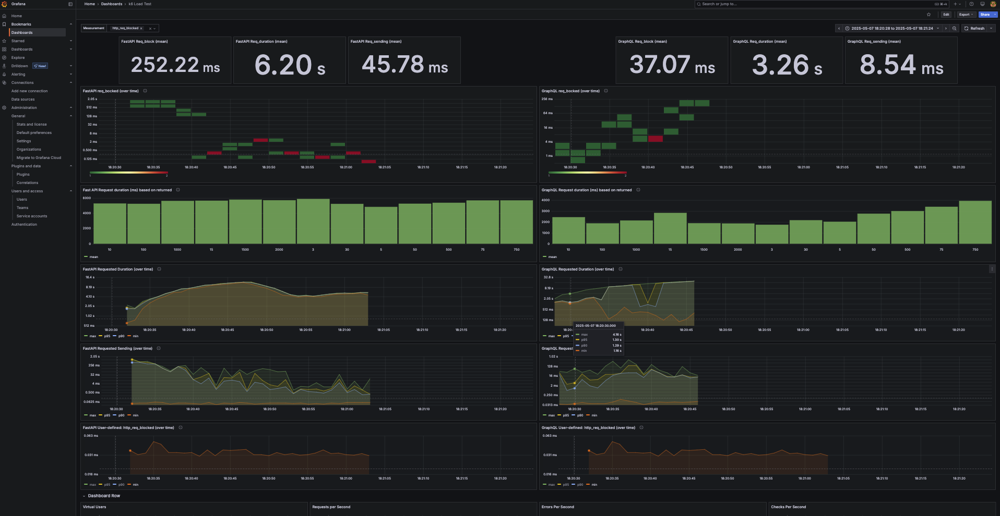
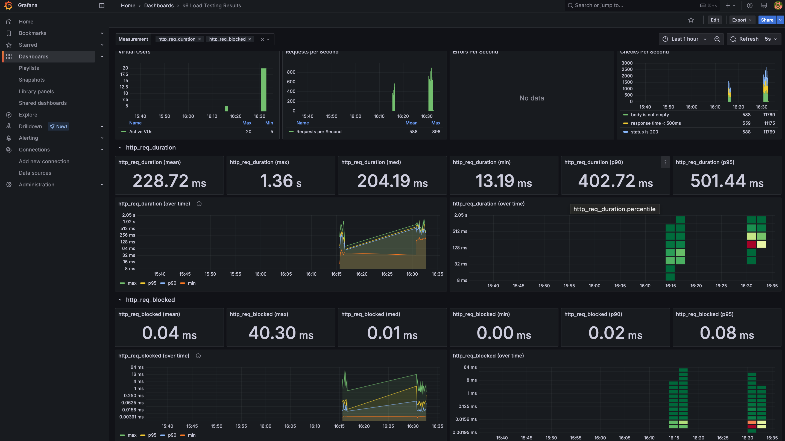

# Bench-the-query



## What is Bench the Query?
- Bench the Query helps developers to choose client servers based on traffic load and context size.
- The containerized Benchmark tool are light-weighted and can be tested seperately.
- A versatile tool to benchmark various client servers with minimal code. 
- Automates deployment for database, query protocols and load test in one docker compile. 
- Furthermore, benchmark results are made accessible in a pre-configured Grafana Dashboard. 
- Users use this tool by entering a list of payload size used in querying and setting desire loads in load test the same way as K6 load test. 

## What Bench the Query is not?
- While more client servers are to be added more a more inclusive benchmark test, the client protocols and security checks are not made to be serve production codes. 


# Running Bench the Query 
Git clone the project
## Step 1
```bash 
git clone https://github.com/evalece/bench-the-query.git 
```

If needed, adjust .env for desired payload lenghth. These are contents in string sizes and will be requested by K6 load test user via GET method. You can also set a desired number of users holding these values in Redis. If not, we will use defualt: 

[View the script](./env)

```bash
# .env, otherwise set by user during docker compose up 
STRING_SIZES=3,5,10,15,30,50,75,100,500,750,1000,1500,2000
NUM_USER=10

```

## Step 2

Customize your K6 load test if you need at:

[View the script](load_test/scripts/k6_options.js)

(For best use of pre-config dashboard, do not delete tags or rename them). 


## Step 3 (Last step)

Docker-Compose EVERYTHING up 
```bash 

docker-compose up

```
And accessing results later by loading pre-config dashboard at 

```bash
 load_test/dashboard/bechmark_dashboard.json
```
Result at:
```bash
http://localhost:3000
```

## (Optional Step) Accessing Results
For accessing the results the first time in Grafana, use the following credential:

Load Live Grafana Dashboard (if using dashboard 2587 with K6 default metrics) 


```bash
 http://localhost:3000

 User:admin
 Passward:admin
 ```

Alternatively, see instructions at the following if you would like to setup your own

```bash
influxDB/readme.md

 ```

## More?

see technical_blogs/README.md for more development story!

## Reference
 1. Dataset: https://www.kaggle.com/datasets/rohanadagouda/cleaned-dataset 
 2. Batch Redis data loading using Riot: https://redis.github.io/riot/#_importing 
 3. Docker compose dependency and other options: https://docs.docker.com/compose/how-tos/startup-order/  
 4. Redis Pipeline: https://redis.io/docs/latest/develop/use/pipelining/ Our case: Allow a toggle on/off to observe RTT effect
 5. Redis SSL/TLS: https://redis.io/docs/latest/operate/rs/security/encryption/tls/enable-tls/ (Unable to test for now due to Enterprise)
 6. A. D. Birrell, B. J. Nelson, and Xerox Palo Alto Research Center, “Implementing remote procedure calls,” Feb. 1984. [Online].   Available: http://birrell.org/andrew/papers/ImplementingRPC.pdf
 7. GraphQL as API endpoint https://graphql.org/faq/best-practices/ 
 8. For REST; Java+Spring- https://redis.io/learn/develop/java/redis-and-spring-course/lesson_2 
 9. Redis Dataset: https://github.com/redis-developer/redis-datasets 
 10. riot https://redis.github.io/riot/#_datagen_struct and fake data gen : https://www.datafaker.net/ 


##  License

Author: Eva Liu; lj2liu@uwaterloo.ca
Initially for job seeking + reviewing & learning DB & distributed sys purpose
ChatGPT assistance in: 
 1. Grammar and proof read of document writing. 
 2. Readability of ReadMe and comments. 
 3. Paraphrasing 80% first version of readme after techincal discussion, 0% on README across all since 3rd push 


CC BY-NC 4.0


