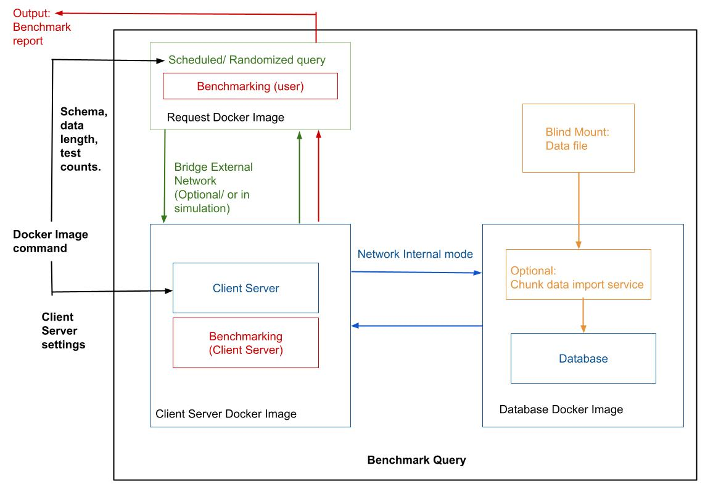

# Bench-the-query

This is a benchmarking tool that helps investigate protocol and database performaances trade offs in a noiseless environment as it offers: 

 1. Setting of Control and Change Variable
 2. Allow transparent network settings and/ or complications (which would lead to potential bias).
 3. Query-type Focus Benchmarking 
 4. Optional tool assiting in converting bulk import of dataset into database in a database-as-change-variable benchmark test. 

##  Planned Features (In development now since March 28, 2025)

- Bench marking with 2 options
    1.Protocol as Change Variable
    2.Databse as Change Variable 

## Planed Development: 

### Technologies (no preferred odering, rollout on development basis.)

- FastAPI
- Ariadne (GraphQL)
- Redis / MongoDB
- Locust for load testing
- (Optional) Docker

### Status

Project in active development.  
First working version coming soon!

## Reference
 1. Dataset: https://www.kaggle.com/datasets/rohanadagouda/cleaned-dataset 
 2. Batch Redis data loading using Riot: https://redis.github.io/riot/#_importing 
 3. Docker compose dependency and other options: https://docs.docker.com/compose/how-tos/startup-order/  
 4. Redis Pipeline: https://redis.io/docs/latest/develop/use/pipelining/ Our case: Allow a toggle on/off to observe RTT effect
 5. Redis SSL/TLS: https://redis.io/docs/latest/operate/rs/security/encryption/tls/enable-tls/ (Unable to test for now due to Enterprise)
 4. Stanford CS244B Reading material, A.D Birrell and B.J Nelson: https://www.scs.stanford.edu/17au-cs244b/sched/readings/birrell_rpc.pdf 

##  License

Author: Eva Liu; lj2liu@uwaterloo.ca
nitially for job seeking + reviewing & learning DB & distributed sys purpose
ChatGPT assistance in: 
 1. Grammar and proof read of document writing. 
 2. Readability of ReadMe and comments. 
 3. Paraphrasing 80% first version of readme after techincal discussion. 

CC BY-NC 4.0

